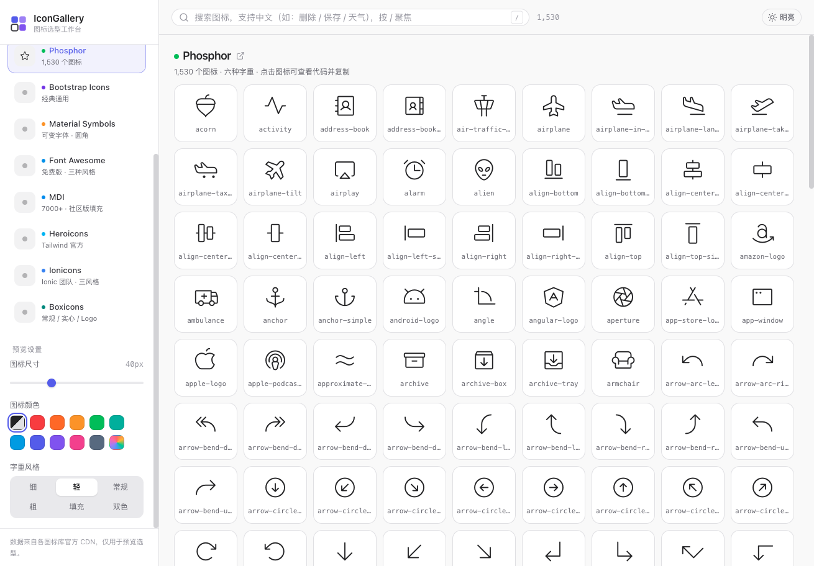
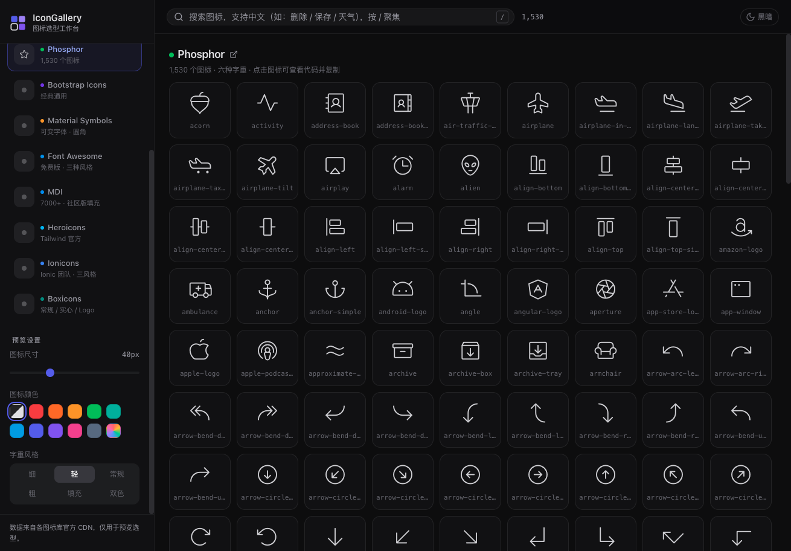

# IconGallery

图标选型工作台 —— 单个 HTML 文件，聚合 11 个主流图标库，为项目选型图标用。

## 使用方法

**在线使用**（GitHub Pages）：

> https://glancers.github.io/IconGallery/

**本地运行**（`file://` 直开部分浏览器会拦截 CDN 数据请求，需走 http）：

```bash
python3 -m http.server 8123
# 打开 http://localhost:8123/index.html
```

也可以把 `index.html` 部署到任意静态服务器，无任何构建依赖。

## 界面预览

| 明亮模式 | 黑暗模式 |
|---|---|
|  |  |

## 收录图标库

| 图标库 | 数量 | 特色 |
|---|---|---|
| Lucide | 1600+ | 线性风格，描边粗细可调 |
| Tabler Icons | 5000+ | 线性 + 填充 |
| Remix Icon | 3000+ | 线条 / 填充双风格 |
| Phosphor | 9000+ | 六种字重（细 / 轻 / 常规 / 粗 / 填充 / 双色） |
| Bootstrap Icons | 2000+ | 经典通用 |
| Material Symbols | 4200+ | 可变字体，填充开关 + 字重滑杆 |
| Font Awesome | 1895（免费版） | 实心 / 常规 / 品牌三风格 |
| MDI | 7400+ | Material Design 社区版 |
| Heroicons | 324×3 | Tailwind 官方，线条 / 实心 / 迷你 |
| Ionicons | 1300×3 | 填充 / 线条 / 棱角 |
| Boxicons | 1600+ | 常规 / 实心 / 品牌 Logo |

图标数据实时从各库官方 CDN 拉取，数量与官网同步。

## 功能

- **中文搜索**：内置 260+ 中文语义词典（如搜「删除」「保存」「天气」），自动展开英文关键词匹配；Lucide 额外接官方 tags 增强命中
- **关键词收窄**：中文搜索后，点关键词 chip 从宽召回切到精确过滤
- **预览调节**：尺寸 16–96px、10 种颜色 + 自定义取色、描边 / 字重 / 填充样式
- **点击图标**：大图预览 + 16/24/32/48/64 多尺寸对照，一键复制名称、CSS 类名、HTML 用法、CDN 引入语句、SVG 源码
- **深浅主题**：右上角切换，所有偏好（库 / 尺寸 / 颜色 / 风格）自动记忆
- **懒加载**：分块渲染，数千图标滚动流畅
- **快捷键**：`/` 聚焦搜索，`Enter` 打开第一个结果，`Esc` 关闭弹窗

## Agent Skill 模式

IconGallery 同时是一个可安装到 AI Agent（Codex、ClaudeCode、OpenClaw、Hermes 等）的 Skill。Agent 可以通过 CLI 命令搜索和获取图标，无需打开浏览器。

### 一键安装

1. 将本仓库克隆或复制到项目中
2. 在 Agent 的配置目录中创建指向 `AGENTS.md` 或 `.trae/skills/icon-gallery/SKILL.md` 的引用
3. 确保 `skill/ig.js` 文件可执行

### CLI 使用

```bash
# 列出所有支持的图标库
node skill/ig.js list

# 搜索图标（支持中英文）
node skill/ig.js search "delete"
node skill/ig.js search "删除"
node skill/ig.js search "天气"

# 限定图标库
node skill/ig.js search "save" --lib lucide

# 获取 SVG 代码和用法
node skill/ig.js get "trash"
node skill/ig.js get "home" --lib lucide
```

### 目录结构

```
icon/
├── .trae/skills/icon-gallery/SKILL.md   # Trae Skill 定义
├── AGENTS.md                            # 通用 Agent 定义
├── skill/
│   └── ig.js                            # CLI 核心脚本
├── index.html                           # Web 界面
├── screenshots/                         # 截图
└── README.md                            # 本文件
```

## 技术说明

纯原生 HTML + CSS + JS，无构建、无依赖、单文件。图标列表解析各库官方 CDN 的 CSS / metadata / 文件树，SVG 类库（Lucide / Heroicons / Ionicons）按需内联渲染。仅供预览选型，图标版权归各库所有。
